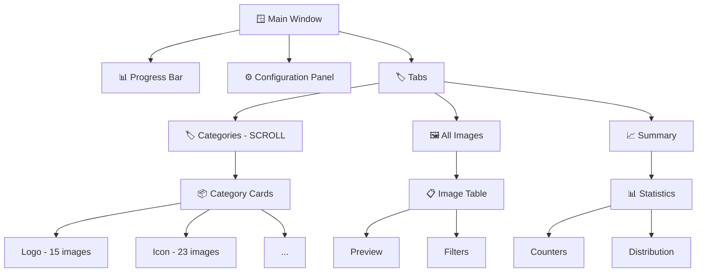

# 🎨 Intelligent Image Extractor Pro

<div align="center">


**An intelligent image extractor with automatic classification and modern GUI**

[📥 Installation](#-installation) •
[🚀 Usage](#-usage) •
[🏗️ Architecture](#️-architecture) •
[📊 Categories](#-categories) •
[⚙️ Configuration](#️-configuration)

</div>

---

## 📋 Table of Contents
- [Overview](#-overview)
- [Key Features](#-key-features)
- [Installation](#-installation)
- [Usage](#-usage)
- [Architecture](#️-colorful-architecture)
- [Image Categories](#-image-categories)
- [User Interface](#-user-interface)
- [Contributing](#-contributing)
- [License](#-license)

---

## 🔍 Overview

**Intelligent Image Extractor Pro** is a powerful tool that recursively crawls websites, extracts all images, and automatically classifies them into more than 25 different categories. The application offers a modern graphical interface with real-time visualization, animated progress bars, and organized downloads by category.

---

## ✨ Key Features

| Feature | Description |
|:---------------|:------------|
| 🕷️ **Recursive Crawling** | Automatic page traversal with depth control |
| 🏷️ **Intelligent Classification** | Automatic detection into 25+ categories |
| 📂 **Automatic Organization** | Structured folders by image category |
| 🖼️ **Live Preview** | Image visualization with complete metadata |
| 📊 **Real-time Statistics** | Progress, speed, counters |
| 🎨 **Modern Interface** | Dark theme, category colors, animations |
| 🔄 **Multi-threading** | Parallel downloads for optimal performance |
| 📁 **JSON/Report Export** | Metadata saving and image listing |

---

## 📦 Installation

### Prerequisites
```bash
Python 3.8 or higher
pip (package manager)
```

### Installation Steps

```bash
# 1. Clone the repository
git clone https://github.com/your-username/intelligent-image-extractor.git
cd intelligent-image-extractor

# 2. Create a virtual environment (optional but recommended)
python -m venv venv
source venv/bin/activate  # Linux/Mac
# or
venv\Scripts\activate     # Windows

# 3. Install dependencies
pip install -r requirements.txt

# 4. Launch the application
python image_extractor.py
```

### 📦 Main Dependencies

```txt
PySide6==6.5.0          # GUI framework
requests==2.31.0        # HTTP requests
beautifulsoup4==4.12.0  # HTML parsing
Pillow==10.0.0          # Image manipulation
urllib3==2.0.0          # Request handling
```

---

## 🚀 Usage

### Quick Start Guide

1. **Enter the URL** of the website to crawl
2. **Configure parameters** (depth, delay, etc.)
3. **Click "Explore"** to start analysis
4. **View categories** in the dedicated tab
5. **Download** by category or all images

### 🎯 Usage Examples

```python
# E-commerce site exploration
URL: https://www.example-shop.com
Configuration: Depth 3, max pages 200
Result: Images classified as Product, Logo, Banner, etc.
```

---

## 🏗️ Colorful Architecture

```
📦 IMAGE EXTRACTOR PRO
├── 🎨 Graphical Interface (GUI Layer)
│   ├── 🪟 MainWindow
│   │   ├── 📊 EnhancedProgressBar
│   │   ├── 🏷️ ScrollableCategoriesWidget
│   │   └── 📋 LogTextEdit
│   └── 🖼️ ImagePreviewDialog
│
├── 🤖 Crawler Engine
│   ├── 🔄 RecursiveCrawler (Thread)
│   ├── 🌐 HTTP Session with retry
│   ├── 🗺️ URL Management
│   └── 📄 HTML Parsing (BeautifulSoup)
│
├── 🧠 Artificial Intelligence (Classification)
│   ├── 📊 ImageClassifier
│   │   ├── 📝 25+ predefined categories
│   │   ├── 🔍 URL and attribute analysis
│   │   ├── 📏 Dimension detection
│   │   └── 🎨 Format recognition
│   └── 💾 ImageInfo (metadata)
│
├── ⬇️ Download Manager
│   ├── 📦 AllCategoriesDownloader (Thread)
│   ├── 🔀 Parallel downloading
│   ├── 📁 Category-based organization
│   └── 📊 Error handling
│
└── 📁 File System
    ├── 🗂️ Category folders
    ├── 💾 Image cache
    ├── 📈 JSON export
    └── 📝 Text reports
```

### 🔄 Data Flow

```
Initial URL
    ↓
🕷️ Recursive Exploration
    ↓
🔍 Image Extraction
    ↓
🏷️ Intelligent Classification
    ↓
📊 Category Display
    ↓
⬇️ Organized Download
    ↓
📂 Structured Folders
```

---

## 📊 Image Categories

The application automatically classifies images into the following categories:

| 🏷️ Category | 🎨 Color | 🔍 Description |
|:--------------|:----------:|:---------------|
| **Logo** | `#FF6B6B` | Logos, brands, headers |
| **Icon** | `#4ECDC4` | Favicons, interface icons |
| **Banner** | `#45B7D1` | Banners, headers, carousels |
| **Product** | `#96CEB4` | Product photos, catalogs |
| **Photo** | `#FFEAA7` | Photographs, galleries |
| **Avatar** | `#DDA0DD` | Profile pictures, team |
| **Background** | `#B0C4DE` | Backgrounds, textures, wallpapers |
| **Button** | `#FAA275` | Interface elements |
| **Social** | `#FFB347` | Social media icons |
| **Flag** | `#A9A9A9` | Flags, languages |
| **Illustration** | `#B5EAD7` | Drawings, vector graphics |
| **Map** | `#C7B198` | Maps, locations |
| **QR Code** | `#59656F` | QR codes, barcodes |
| **Spinner** | `#9C89B8` | Loaders, animations |
| **Badge** | `#FADADD` | Labels, tags, certifications |
| **Animated GIF** | `#A8D8EA` | Animations |
| **Encoded Image** | `#C5A9DF` | Data URLs |
| **Vector** | `#A7C7E7` | SVG, vector images |
| **Transparent** | `#C5E0D8` | PNG with transparency |
| **Thumbnail** | `#D4B8B8` | Small images |

---

## 💻 User Interface

### 🎨 Main Components



### ✨ Interface Highlights

- **Enhanced Progress Bar** with speed indicator
- **Category Cards** with distinctive colors
- **Scroll Area** for unlimited categories
- **Image Preview** with complete metadata
- **Real-time Log** with syntax highlighting
- **Keyboard Shortcuts** and toolbar

---

## ⚙️ Configuration

### Crawling Parameters

| Parameter | Range | Default | Description |
|:----------|:-----:|:------:|:------------|
| Max Pages | 10-1000 | 100 | Maximum number of pages to crawl |
| Depth | 1-10 | 5 | Maximum recursive depth |
| Delay | 0-5s | 1s | Pause between requests |
| Subdomains | Yes/No | No | Include subdomains |
| Classification | Yes/No | Yes | Classify during crawling |

### Configuration Files

```json
// settings.json (automatically generated)
{
  "last_url": "https://example.com",
  "download_folder": "classified_images",
  "max_pages": 100,
  "max_depth": 5,
  "delay": 1,
  "include_subdomains": false,
  "classify_immediately": true
}
```

---

## 🤝 Contributing

Contributions are welcome! Here's how to participate:

1. 🍴 Fork the project
2. 🌿 Create your branch (`git checkout -b feature/AmazingFeature`)
3. 💾 Commit your changes (`git commit -m 'Add some AmazingFeature'`)
4. 📤 Push to the branch (`git push origin feature/AmazingFeature`)
5. 🔀 Open a Pull Request

### 📝 Contribution Guidelines

- Follow existing code style
- Document new features
- Test before submitting
- Use clear commit messages

---

## 📈 Roadmap

- [x] Version 1.0: Basic crawling
- [x] Version 2.0: Simple classification
- [x] Version 3.0: GUI interface
- [x] Version 4.0: Multi-categories and SCROLL
- [ ] Version 5.0: Batch mode and command line
- [ ] Version 6.0: REST API
- [ ] Version 7.0: Advanced AI

---

## 📄 License

Distributed under the MIT License. See `LICENSE` for more information.

---

## 📬 Contact

- **Developer** - [@yomarbadrani](https://github.com/omarbadrani)


---

<div align="center">
  
### ⭐ If this project helped you, don't hesitate to give it a star! ⭐

**[⬆ Back to top](#-intelligent-image-extractor-pro)**

</div>
